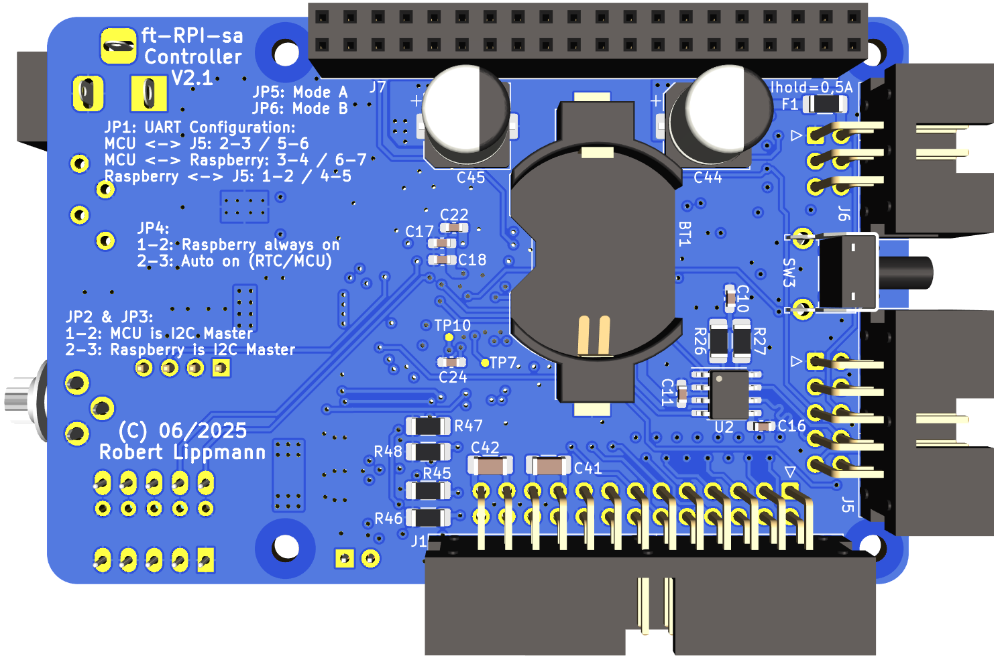

# ft-RPI-sa
The ft-RPI-sa controller is a versatile enhancement developed to control models primarily built with fischertechnik but can be also used with Lego or any other kind of technical toy, limited to 12V supply and I/O voltage.
It consists of the main compute board (aka mainboard), covering all the required logic circuitry, and an additional I/O board with all the inputs and outputs to connect to the model. The I/O board feature standard mini-banana-plug connectors with a diameter of 2.5mm. The mainboard can be optionally used as a Raspberry Pi HAT and is supplied by either a battery set or an external 9V power supply.

# Mainboard V2.1 Top View

# Mainboard V2.1 Bottom View

# I/O Board Top View

# Features
 - Using NXP Microcontroller S32K142 or S32K144(W) or S32K146 w/o hardware modification
 - 8 independent 9V inputs (supporting analog & digital input capability with individual
   programable pull configuration)
 - 8 outputs which can be used independently or in combination for brushed or stepper Microcontroller
 - 4 independent 9V counter inputs which can use DMA for counting
 - Using a separate board for I/O connectors
 - Can be used as Raspberry Pi HAT with integrated power supply for the Raspberry Pi
 - Interfaces like UART (TTL), I2C (5V and 3V3), CAN-PHY, SPI (also useable with Raspberry Pi SPI1)
   to be used with additional peripherals
 - RTC incl. 512 Bytes RAM, w/ battery backup, useable for optional timed wakeup/activities
 - Full featured MMBasic interpreter including an editor running on S32K14x using UART
 - MMBasic interpreter enhanced with commands and functions to support on-board peripherals
 - Using a simple terminal program, running either on Raspberry Pi or on a PC/MAC, for SW development
 - Program transfer done via XMODEM up-/download to/from host computer
 - MMBasic program stored in D-Flash memory (64k) of MCU
 - Optional auto start of MMBasic application once powering up
 
# YouTube video
&nbsp;&nbsp;&nbsp;&nbsp;
 - [Video of 2 fischertechnik models controlled by the ft-RPI-sa](https://www.youtube.com/watch?v=sPbV3bQHXdk)

# Copyright and Acknowledgements

MMBasic interpreter:

Thanks to Geoff for granting me the permission to adapt his beautiful MMBasic interpreter to this hardware project.
 - https://geoffg.net/micromite.html
 - Copyright 2011-2024 Geoff Graham
 - Copyright 2016-2024 Peter Mather

MMBasic enhancements and modifications related to ft-RPI-sa hardware:
- Copyright 2022-2025 Robert Lippmann (ft.mcu.prj@gmail.com)
  
ft-RPI-sa Hardware:

- Copyright 2022-2025 Robert Lippmann (ft.mcu.prj@gmail.com)
